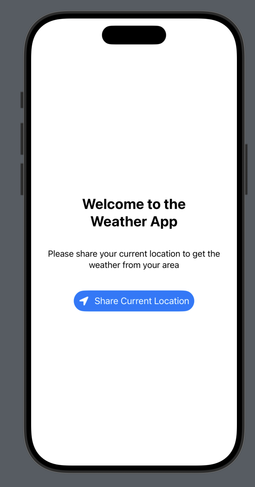
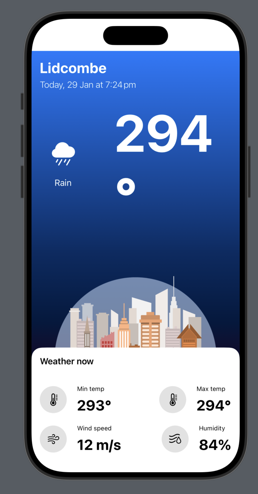

# Weather App made using SwiftUI

## Information
This app is a work sample for SwiftUI.

## About the App

 * This App takes user's location and shows weather information.
 * Weather information contains -
   * Current temprature
   * Minimum temperature
   * Maximum temperature
   * Wind speed
   * Humidity
 * It also shows the location and time
 * This app also have dynamic background and weather icon

## Screenshots

Screenshots have dummy data so ignore 200+ degree in the screen below.

